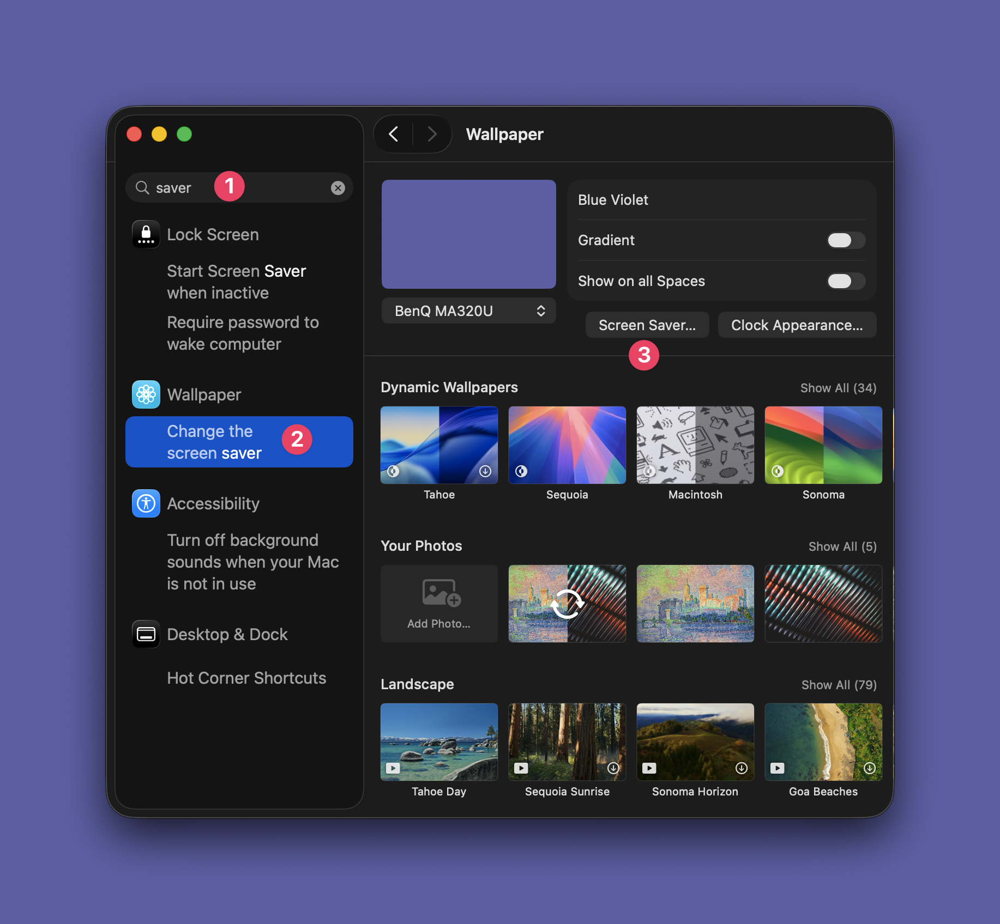

# Lightpaper

Photographers have tens or hundreds of thousands of images sitting unused in
Lightroom. Lightpaper turns the local Lightroom cache into a macOS wallpaper /
screen saver, so those photos keep resurfacing for you, your family, and friends.

Lightpaper only reads local cached Lightroom Desktop files. It does not contact
Adobe, sign in to your account, or communicate with remote Adobe storage.

## Install

No toolchain required — both options install a prebuilt universal `.saver` from
the latest [GitHub release](https://github.com/dmitri-b/lightpaper/releases).

Homebrew (recommended):

```sh
brew install --cask dmitri-b/tap/lightpaper
```

Or a one-line script:

```sh
curl -fsSL https://raw.githubusercontent.com/dmitri-b/lightpaper/master/scripts/install.sh | sh
```

Enable it:

1. Open System Settings.
2. Go to Screen Saver.
3. Pick Lightpaper.

### If macOS blocks it

Lightpaper is not notarized, so Gatekeeper blocks it the first time with
"Apple could not verify ... is free of malware". To allow it (once per Mac):

1. In System Settings > Screen Saver, select Lightpaper and dismiss the dialog.
2. Open System Settings > Privacy & Security and scroll to the Security section.
3. Click **Open Anyway** next to the Lightpaper message and authenticate.
4. Re-select Lightpaper in Screen Saver — it now loads.

The one-line script also clears the download quarantine flag for you; on older
macOS that alone is enough, but recent versions still require the Open Anyway
step above.

### Updating

After upgrading (`brew upgrade` or re-running the script), macOS may keep
running the previously loaded bundle from its cache, so you still see the old
version. Flush it by recycling the screen-saver host processes:

```sh
killall legacyScreenSaver legacyScreenSaver-x86_64 WallpaperAgent 2>/dev/null
```

Then reopen System Settings > Screen Saver. (Logging out and back in achieves
the same thing.)

### Build from source

```sh
gh repo clone dmitri-b/lightpaper
cd lightpaper
./scripts/install-saver.sh
```

## Privacy mode

If a shared screen shouldn't show portraits, turn on privacy mode: photos that
prominently feature a person (headshots, posed shots) are skipped, while scenery
that merely contains a small, distant bystander is kept.

```sh
defaults -currentHost write dev.lightpaper.Lightpaper.ScreenSaver hidePeople -bool true
```

Turn it back off with `-bool false`. Either way, flush the screen-saver host so
the change is picked up (same as after updating):

```sh
killall legacyScreenSaver legacyScreenSaver-x86_64 WallpaperAgent 2>/dev/null
```

Detection runs entirely on-device (Apple's Vision framework); no photo ever
leaves your Mac.

## Screenshots

Final wallpaper:


macOS Screen Saver setting:



## Debug

Build and open the app bundle:

```sh
./scripts/build-app.sh
open .build/Lightpaper.app
```

Run windowed:

```sh
swift run lightpaper-view -- --windowed --mode mosaic --limit 500
swift run lightpaper-view -- --windowed --mode slideshow --source previews
```

Scan the Lightroom cache:

```sh
swift run lightpaper-scan -- --source previews --limit 10
swift run lightpaper-scan -- --json
```

Keys:

- `Space`, `Right`, `Down`, `L`: next
- `Left`, `Up`, `J`: previous
- `Esc`, `Q`: quit

Requires a local Lightroom Desktop library at `~/Pictures/Lightroom Library.lrlibrary`.
